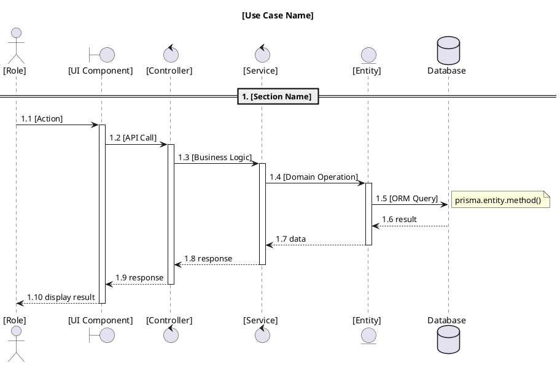
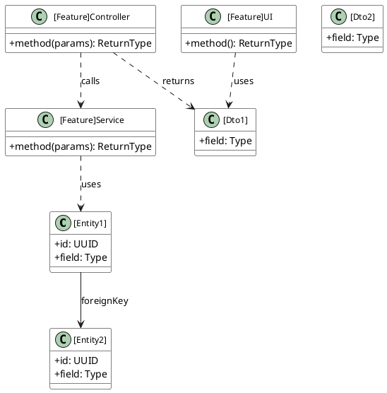
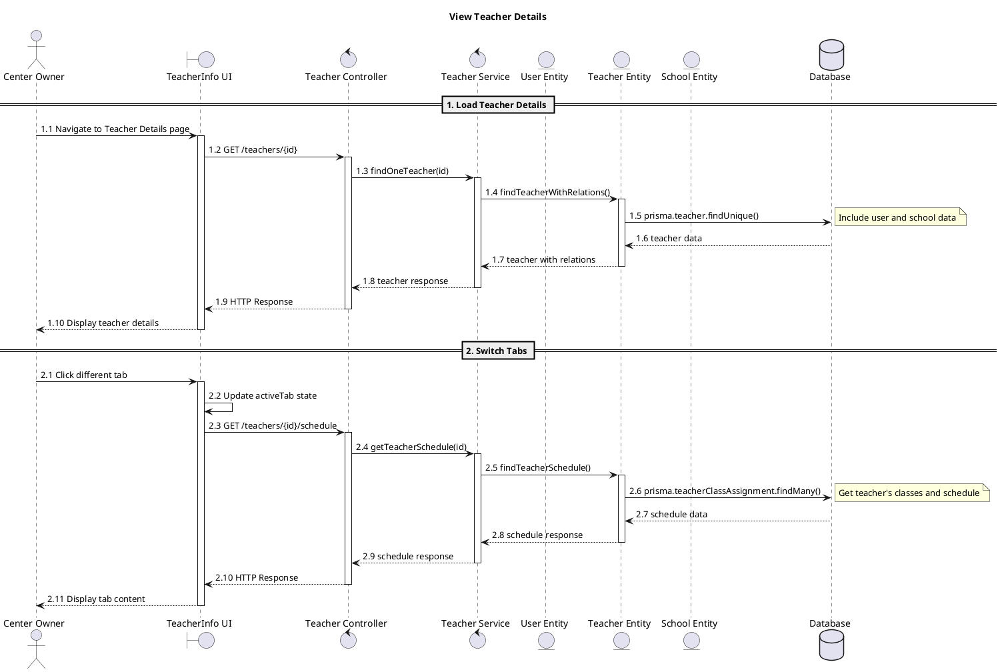
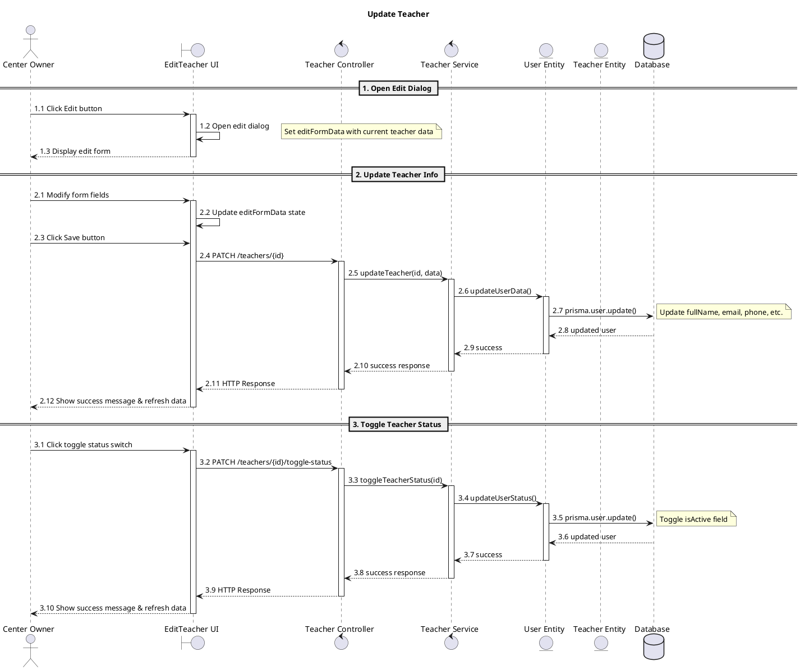
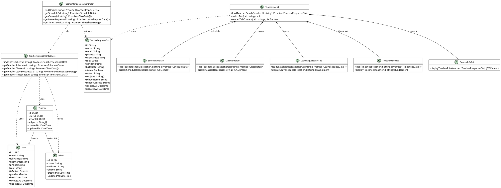
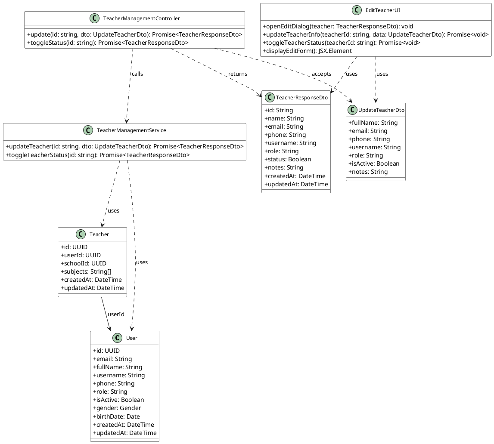

# Form Chuẩn cho Sequence Diagram và Class Diagram

## Sequence Diagram Format

### Cấu trúc Participants
- **Actor**: Người dùng cuối (Center Owner, Teacher, Student, Parent)
- **Boundary**: UI Components (React components)
- **Control**: Controllers và Services (Backend logic)
- **Entity**: Domain entities (Prisma models)
- **Database**: Database (PostgreSQL)

### Format chuẩn:


### Quy tắc:
- Sử dụng số thứ tự cho các luồng (1.1, 1.2, 1.3...)
- Có activate/deactivate cho mỗi component
- Có notes cho SQL queries (ORM syntax)
- Chia thành sections với ==
- Có alt/else cho error handling

## Class Diagram Format

### Cấu trúc Classes

#### 1. Domain Entities (từ Prisma)
```plantuml
class "[EntityName]" as EntityName {
  +id: UUID
  +field1: String
  +field2: Number
  +field3: Date
  +createdAt: DateTime
  +updatedAt: DateTime
}
```

#### 2. DTOs (Data Transfer Objects)
```plantuml
class "[DtoName]" as DtoName {
  +field1: String
  +field2: Number
  +field3: Date
}
```

#### 3. Application Layer
```plantuml
class "[Feature]Controller" as Controller {
  +method1(params): ReturnType
  +method2(params): ReturnType
}

class "[Feature]Service" as Service {
  +method1(params): ReturnType
  +method2(params): ReturnType
}

class "[Feature]UI" as UI {
  +loadData(): Promise<DataType>
  +handleAction(): void
  +renderContent(): JSX.Element
}
```

### Format chuẩn:


### Quan hệ:
- **Entities**: `-->` cho foreign keys
- **Service**: `..>` Entity (uses)
- **Controller**: `..>` Service (calls)
- **Controller**: `..>` DTO (returns)
- **UI**: `..>` DTO (uses)
- **Composition**: `*--` cho DTOs lồng nhau

## Ví dụ cụ thể

### Sequence Diagram - View Teacher Details


### Sequence Diagram - Update Teacher


### Class Diagram - View Teacher Details


### Class Diagram - Update Teacher


## Quy tắc chung

### Sequence Diagram:
1. **Participants**: Chỉ UI, Controller, Service, Entity, Database
2. **Flow**: Bắt đầu từ User action, kết thúc ở User feedback
3. **Numbering**: Số thứ tự rõ ràng cho mỗi step
4. **Activation**: Có activate/deactivate cho mỗi component
5. **Notes**: Chỉ ghi ORM queries, không ghi HTTP details
6. **Error handling**: Có alt/else cho các trường hợp lỗi

### Class Diagram:
1. **Entities**: Chỉ các field chính, kiểu dữ liệu cơ bản
2. **DTOs**: Chỉ các field cần thiết cho API
3. **Controllers**: Chỉ các method public
4. **Services**: Chỉ các method public
5. **UI**: Chỉ các method chính
6. **Relationships**: Rõ ràng, không phức tạp

### Loại bỏ:
- API Client, HTTP details
- React Query, state management details
- Validation logic chi tiết
- Error handling phức tạp
- Implementation details không cần thiết
