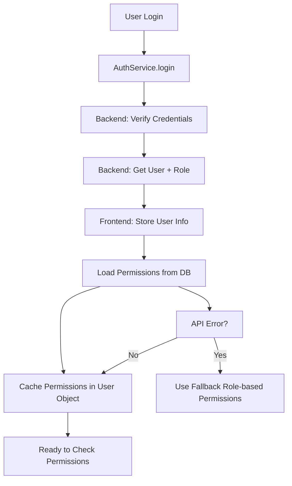
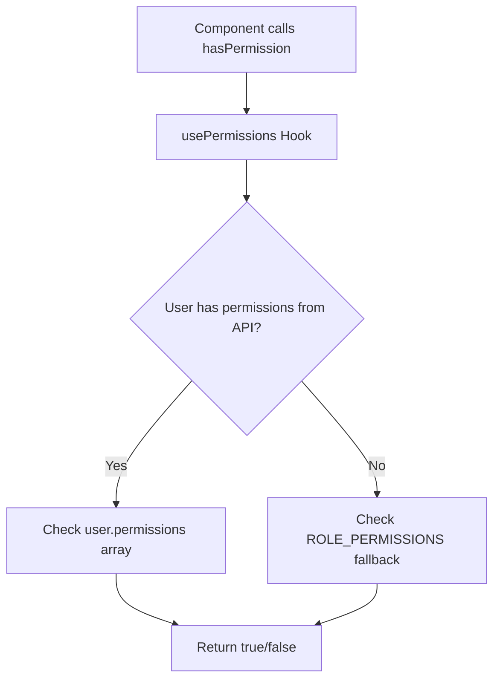
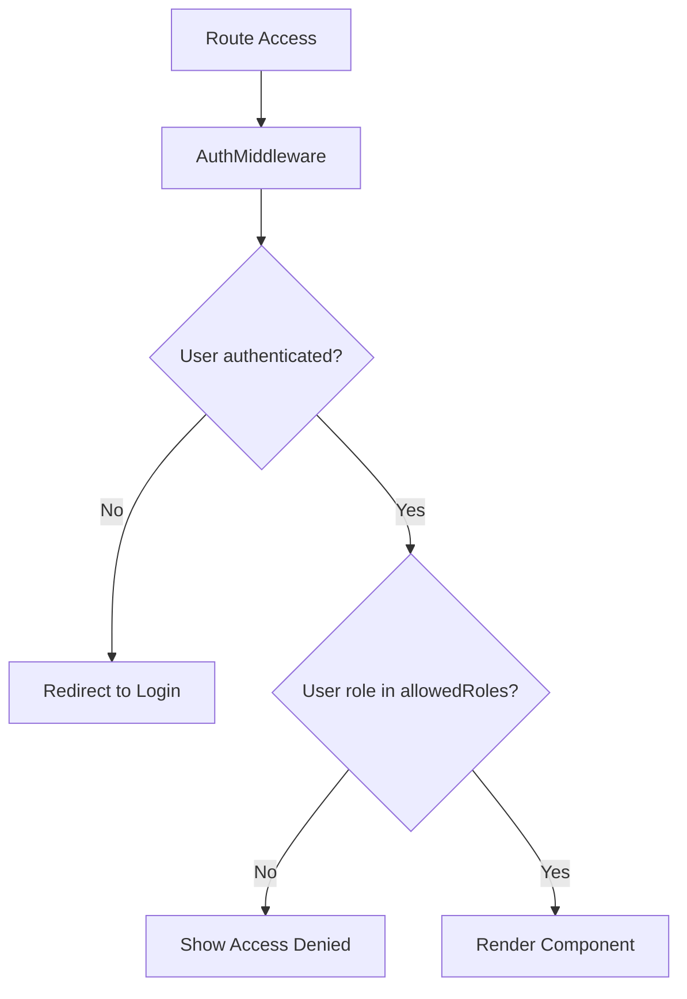
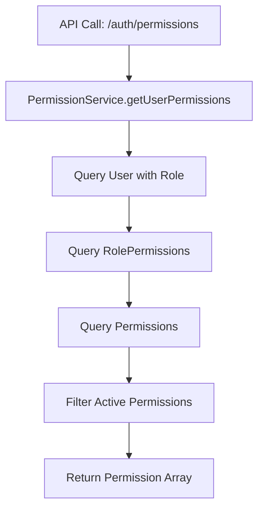

# Hệ thống Permission - Hướng dẫn sử dụng và luồng hoạt động

## Tổng quan

Hệ thống permission trong dự án này sử dụng mô hình **Role-Based Access Control (RBAC)** với kiến trúc 3 tầng:

1. **Database Layer**: Lưu trữ roles, permissions và mối quan hệ trong PostgreSQL
2. **Backend API**: Cung cấp endpoints để kiểm tra và lấy permissions từ database
3. **Frontend Layer**: Kiểm tra permissions với fallback mechanism

### Luồng hoạt động chính
```
User Login → Load Permissions từ DB → Cache trong Frontend → Check Permissions
     ↓
Fallback to Role-based permissions nếu API lỗi
```

## Cấu trúc Database

### Bảng chính
```sql
-- Bảng vai trò
CREATE TABLE roles (
  id UUID PRIMARY KEY DEFAULT gen_random_uuid(),
  name VARCHAR(50) UNIQUE NOT NULL,
  display_name VARCHAR(100) NOT NULL,
  description TEXT,
  is_active BOOLEAN DEFAULT true,
  created_at TIMESTAMPTZ DEFAULT NOW(),
  updated_at TIMESTAMPTZ DEFAULT NOW()
);

-- Bảng quyền hạn  
CREATE TABLE permissions (
  id UUID PRIMARY KEY DEFAULT gen_random_uuid(),
  name VARCHAR(100) UNIQUE NOT NULL,
  display_name VARCHAR(150) NOT NULL,
  description TEXT,
  module VARCHAR(50) NOT NULL,  -- students, teachers, courses, etc.
  action VARCHAR(50) NOT NULL,  -- view, create, edit, delete, etc.
  is_active BOOLEAN DEFAULT true,
  created_at TIMESTAMPTZ DEFAULT NOW(),
  updated_at TIMESTAMPTZ DEFAULT NOW()
);

-- Bảng liên kết vai trò - quyền hạn
CREATE TABLE role_permissions (
  id UUID PRIMARY KEY DEFAULT gen_random_uuid(),
  role_id UUID REFERENCES roles(id) ON DELETE CASCADE,
  permission_id UUID REFERENCES permissions(id) ON DELETE CASCADE,
  created_at TIMESTAMPTZ DEFAULT NOW(),
  UNIQUE(role_id, permission_id)
);
```

### Các vai trò hiện có
- `center_owner`: Chủ trung tâm (toàn quyền quản lý trung tâm)
- `teacher`: Giáo viên (quyền hạn hạn chế, chỉ xem và quản lý lớp)
- `admin`: Quản trị viên hệ thống (quyền quản lý toàn bộ hệ thống)
- `student`: Học sinh (chỉ xem thông tin cá nhân)
- `parent`: Phụ huynh (xem thông tin con em)

## Backend API Endpoints

### Permission Management Endpoints
```typescript
// Lấy permissions của user hiện tại
GET /auth/permissions
Response: { data: Permission[] }

// Kiểm tra permission cụ thể
GET /auth/permissions/check/{permissionName}
Response: { data: { hasPermission: boolean } }

// Lấy tất cả roles
GET /auth/roles
Response: { data: Role[] }

// Lấy tất cả permissions
GET /auth/all-permissions
Response: { data: Permission[] }
```

### Permission Service (Backend)
```typescript
// server/src/modules/auth/permission.service.ts
export class PermissionService {
  // Lấy permissions của user từ database
  async getUserPermissions(userId: string): Promise<Permission[]>
  
  // Kiểm tra permission cụ thể
  async hasPermission(userId: string, permissionName: string): Promise<boolean>
  
  // Kiểm tra bất kỳ permission nào
  async hasAnyPermission(userId: string, permissionNames: string[]): Promise<boolean>
  
  // Kiểm tra tất cả permissions
  async hasAllPermissions(userId: string, permissionNames: string[]): Promise<boolean>
}
```

## Cấu trúc Frontend

### 1. Permission Types Definition
**File**: `client/src/lib/permission.tsx`

```typescript
export type Permission =
  // Student management
  | "students.view" | "students.create" | "students.edit" | "students.delete"
  | "students.enrollment" | "students.attendance"
  
  // Teacher management  
  | "teachers.view" | "teachers.create" | "teachers.edit" | "teachers.delete"
  | "teachers.assign"
  
  // Course management
  | "courses.view" | "courses.create" | "courses.edit" | "courses.delete"
  | "courses.assign"
  
  // Schedule management
  | "schedule.view" | "schedule.create" | "schedule.edit" | "schedule.delete"
  
  // Financial management
  | "finance.view" | "finance.create" | "finance.edit" | "finance.delete"
  | "finance.reports"
  
  // Reports and analytics
  | "reports.view" | "reports.export" | "reports.advanced"
  
  // System settings
  | "settings.view" | "settings.edit" | "settings.system"
  
  // User management
  | "users.view" | "users.create" | "users.edit" | "users.delete"
```

### 2. Fallback Role-Permission Mapping
```typescript
// Chỉ dùng làm fallback khi API lỗi
export const ROLE_PERMISSIONS: Record<string, Permission[]> = {
  center_owner: [
    // Toàn quyền truy cập
    "students.view", "students.create", "students.edit", "students.delete",
    "teachers.view", "teachers.create", "teachers.edit", "teachers.delete",
    "courses.view", "courses.create", "courses.edit", "courses.delete",
    "schedule.view", "schedule.create", "schedule.edit", "schedule.delete",
    "finance.view", "finance.create", "finance.edit", "finance.delete",
    "reports.view", "reports.export", "reports.advanced",
    "settings.view", "settings.edit", "settings.system",
    "users.view", "users.create", "users.edit", "users.delete"
  ],
  teacher: [
    // Quyền hạn hạn chế
    "students.view", "students.attendance",
    "courses.view", "schedule.view", 
    "reports.view", "settings.view"
  ],
  admin: [
    // Quyền quản trị hệ thống (không có finance.create)
    "students.view", "students.create", "students.edit", "students.delete",
    "teachers.view", "teachers.create", "teachers.edit", "teachers.delete",
    "courses.view", "courses.create", "courses.edit", "courses.delete",
    "schedule.view", "schedule.create", "schedule.edit", "schedule.delete",
    "finance.view", "finance.reports", // Không có finance.create
    "reports.view", "reports.export", "reports.advanced",
    "settings.view", "settings.edit", "settings.system",
    "users.view", "users.create", "users.edit", "users.delete"
  ]
}
```

## Luồng hoạt động chi tiết

### 1. Authentication & Permission Loading Flow


### 2. Permission Check Flow


### 3. Route Protection Flow


### 4. Database Permission Flow


## Cách sử dụng trong Frontend

### 1. Hook usePermissions - Cách hoạt động

```typescript
// client/src/hooks/use-permission.ts
export function usePermissions() {
  const { user } = useAuth()

  const checkPermission = (permission: Permission): boolean => {
    if (!user) return false
    
    // Ưu tiên: Nếu có permissions từ API, dùng nó
    if (user.permissions && user.permissions.length > 0) {
      return user.permissions.includes(permission)
    }
    
    // Fallback: Nếu API lỗi, dùng role-based permission check
    return hasPermission(user.role, permission)
  }

  return {
    hasPermission: checkPermission,
    hasAnyPermission: (permissions) => permissions.some(checkPermission),
    hasAllPermissions: (permissions) => permissions.every(checkPermission),
    userRole: user?.role,
    userPermissions: user?.permissions || []
  }
}
```

### 2. Sử dụng trong Components

```typescript
import { usePermissions } from '../hooks/use-permission'

function StudentManagement() {
  const { 
    hasPermission, 
    hasAnyPermission, 
    hasAllPermissions,
    userRole,
    userPermissions 
  } = usePermissions()

  return (
    <div>
      <h1>Quản lý học sinh</h1>
      
      {/* Kiểm tra 1 permission */}
      {hasPermission('students.create') && (
        <Button onClick={handleCreateStudent}>
          Thêm học sinh mới
        </Button>
      )}

      {/* Kiểm tra bất kỳ permission nào */}
      {hasAnyPermission(['students.edit', 'students.delete']) && (
        <div className="flex gap-2">
          <Button onClick={handleEdit}>Sửa</Button>
          <Button onClick={handleDelete}>Xóa</Button>
        </div>
      )}

      {/* Kiểm tra tất cả permissions */}
      {hasAllPermissions(['students.view', 'students.edit']) && (
        <AdvancedStudentManagement />
      )}

      {/* Debug info */}
      <div className="text-sm text-gray-500 mt-4">
        <p>Role: {userRole}</p>
        <p>Permissions: {userPermissions.length} quyền hạn</p>
      </div>
    </div>
  )
}
```

### 3. PermissionGuard Component

```typescript
// client/src/pages/Auth/Permission-guard.tsx
interface PermissionGuardProps {
  children: React.ReactNode
  permission?: Permission
  permissions?: Permission[]
  requireAll?: boolean
  fallback?: React.ReactNode
}

export function PermissionGuard({
  children,
  permission,
  permissions = [],
  requireAll = false,
  fallback,
}: PermissionGuardProps) {
  const { hasPermission, hasAnyPermission, hasAllPermissions } = usePermissions()

  let hasAccess = false

  if (permission) {
    hasAccess = hasPermission(permission)
  } else if (permissions.length > 0) {
    hasAccess = requireAll ? hasAllPermissions(permissions) : hasAnyPermission(permissions)
  } else {
    hasAccess = true // No permissions specified, allow access
  }

  if (!hasAccess) {
    return fallback ? <>{fallback}</> : null
  }

  return <>{children}</>
}
```

### 4. Sử dụng PermissionGuard

```typescript
import { PermissionGuard } from '../components/Auth/Permission-guard'

function StudentManagement() {
  return (
    <div>
      {/* Chỉ hiển thị nếu có quyền tạo học sinh */}
      <PermissionGuard permission="students.create">
        <Button onClick={handleCreateStudent}>
          Thêm học sinh mới
        </Button>
      </PermissionGuard>

      {/* Hiển thị nếu có bất kỳ quyền nào */}
      <PermissionGuard 
        permissions={['students.edit', 'students.delete']}
        requireAll={false}
      >
        <div className="flex gap-2">
          <Button onClick={handleEdit}>Sửa</Button>
          <Button onClick={handleDelete}>Xóa</Button>
        </div>
      </PermissionGuard>

      {/* Hiển thị nếu có tất cả quyền với fallback UI */}
      <PermissionGuard 
        permissions={['students.view', 'students.edit']}
        requireAll={true}
        fallback={
          <div className="text-center p-4 text-gray-500">
            <p>Bạn cần quyền xem và chỉnh sửa học sinh để sử dụng tính năng này</p>
          </div>
        }
      >
        <AdvancedStudentManagement />
      </PermissionGuard>
    </div>
  )
}
```

### 5. Route Protection

```typescript
// client/src/routes/privateRoutes.tsx
import AuthMiddleware from "../middlewares/AuthMiddleware"

export const privateRoutes = (
  <>
    <Route element={<DefaultLayout />}>
      {/* Chủ trung tâm - Chỉ center_owner mới vào được */}
      <Route path="/center-qn" element={<AuthMiddleware allowedRoles={['center_owner']}/>}>
        <Route index element={<CenterOwnerDashboard />} />
        <Route path="students" element={<StudentsManagement />} />
        <Route path="teachers" element={<TeacherManagement />} />
        <Route path="teachers/:id" element={<TeacherDetails />} />
        <Route path="schedule" element={<CenterSchedulePage />} />
        <Route path="finance" element={<FinanceManagement />} />
        <Route path="reports" element={<ReportsPage />} />
      </Route>

      {/* Giáo viên - Chỉ teacher mới vào được */}
      <Route path="/teacher" element={<AuthMiddleware allowedRoles={['teacher']}/>}>
        <Route path="profile" element={<TeacherProfilePage />} />
        <Route path="schedule" element={<TeacherSchedule />} />
        <Route path="classes" element={<TeacherManageClass />} />
        <Route path="classes/:classId" element={<ClassDetailsPage />} />
      </Route>

      {/* Học sinh - Chỉ student mới vào được */}
      <Route path="/student" element={<AuthMiddleware allowedRoles={['student']}/>}>
        <Route index element={<StudentDashboard />} />
        <Route path="schedule" element={<StudentSchedule />} />
        <Route path="grades" element={<StudentGrades />} />
      </Route>

      {/* Phụ huynh - Chỉ parent mới vào được */}
      <Route path="/parent" element={<AuthMiddleware allowedRoles={['parent']}/>}>
        <Route index element={<ParentDashboard />} />
        <Route path="children" element={<ChildrenManagement />} />
        <Route path="reports" element={<ParentReports />} />
      </Route>

      {/* Admin - Chỉ admin mới vào được */}
      <Route path="/admin" element={<AuthMiddleware allowedRoles={['admin']}/>}>
        <Route index element={<AdminDashboard />} />
        <Route path="users" element={<UserManagement />} />
        <Route path="system" element={<SystemSettings />} />
      </Route>
    </Route>
  </>
)
```

### 6. Conditional Rendering trong Tables

```typescript
function StudentTable() {
  const { hasPermission } = usePermissions()

  return (
    <div>
      <div className="flex justify-between items-center mb-4">
        <h2>Danh sách học sinh</h2>
        
        {/* Chỉ hiển thị nút tạo nếu có quyền */}
        {hasPermission('students.create') && (
          <Button onClick={handleCreate} className="bg-blue-600">
            <Plus className="w-4 h-4 mr-2" />
            Thêm học sinh
          </Button>
        )}
      </div>

      <Table>
        <TableHeader>
          <TableRow>
            <TableHead>Tên</TableHead>
            <TableHead>Email</TableHead>
            <TableHead>Lớp</TableHead>
            <TableHead>Trạng thái</TableHead>
            {/* Chỉ hiển thị cột thao tác nếu có quyền */}
            {(hasPermission('students.edit') || hasPermission('students.delete')) && (
              <TableHead>Thao tác</TableHead>
            )}
          </TableRow>
        </TableHeader>
        <TableBody>
          {students.map(student => (
            <TableRow key={student.id}>
              <TableCell>{student.name}</TableCell>
              <TableCell>{student.email}</TableCell>
              <TableCell>{student.className}</TableCell>
              <TableCell>
                <Badge variant={student.isActive ? "default" : "secondary"}>
                  {student.isActive ? "Hoạt động" : "Tạm dừng"}
                </Badge>
              </TableCell>
              
              {/* Chỉ hiển thị cột thao tác nếu có quyền */}
              {(hasPermission('students.edit') || hasPermission('students.delete')) && (
                <TableCell>
                  <div className="flex gap-2">
                    {hasPermission('students.edit') && (
                      <Button 
                        size="sm" 
                        variant="outline"
                        onClick={() => handleEdit(student.id)}
                      >
                        <Edit className="w-4 h-4 mr-1" />
                        Sửa
                      </Button>
                    )}
                    
                    {hasPermission('students.delete') && (
                      <Button 
                        size="sm" 
                        variant="destructive"
                        onClick={() => handleDelete(student.id)}
                      >
                        <Trash className="w-4 h-4 mr-1" />
                        Xóa
                      </Button>
                    )}
                  </div>
                </TableCell>
              )}
            </TableRow>
          ))}
        </TableBody>
      </Table>
    </div>
  )
}
```

## Backend Implementation

### 1. Permission Service (NestJS)

```typescript
// server/src/modules/auth/permission.service.ts
@Injectable()
export class PermissionService {
  constructor(private prisma: PrismaService) {}

  // Lấy tất cả permissions của user từ database
  async getUserPermissions(userId: string): Promise<Permission[]> {
    const user = await this.prisma.user.findUnique({
      where: { id: userId },
      include: {
        roleData: {
          include: {
            rolePermissions: {
              include: { permission: true }
            }
          }
        }
      }
    })

    if (!user || !user.roleData) return []

    return user.roleData.rolePermissions
      .filter(rp => rp.permission.isActive)
      .map(rp => ({
        id: rp.permission.id,
        name: rp.permission.name,
        displayName: rp.permission.displayName,
        module: rp.permission.module,
        action: rp.permission.action,
        isActive: rp.permission.isActive
      }))
  }

  // Kiểm tra permission cụ thể
  async hasPermission(userId: string, permissionName: string): Promise<boolean> {
    const permissions = await this.getUserPermissions(userId)
    return permissions.some(p => p.name === permissionName)
  }

  // Kiểm tra bất kỳ permission nào
  async hasAnyPermission(userId: string, permissionNames: string[]): Promise<boolean> {
    const permissions = await this.getUserPermissions(userId)
    const userPermissionNames = permissions.map(p => p.name)
    return permissionNames.some(name => userPermissionNames.includes(name))
  }

  // Kiểm tra tất cả permissions
  async hasAllPermissions(userId: string, permissionNames: string[]): Promise<boolean> {
    const permissions = await this.getUserPermissions(userId)
    const userPermissionNames = permissions.map(p => p.name)
    return permissionNames.every(name => userPermissionNames.includes(name))
  }
}
```

### 2. Permission Controller

```typescript
// server/src/modules/auth/controllers/permission.controller.ts
@Controller('auth')
export class PermissionController {
  constructor(private permissionService: PermissionService) {}

  @Get('permissions')
  @UseGuards(JwtAuthGuard)
  async getUserPermissions(@Request() req) {
    const permissions = await this.permissionService.getUserPermissions(req.user.id)
    return { data: permissions }
  }

  @Get('permissions/check/:permissionName')
  @UseGuards(JwtAuthGuard)
  async checkPermission(
    @Request() req,
    @Param('permissionName') permissionName: string
  ) {
    const hasPermission = await this.permissionService.hasPermission(
      req.user.id, 
      permissionName
    )
    return { data: { hasPermission } }
  }

  @Get('roles')
  async getAllRoles() {
    const roles = await this.permissionService.getAllRoles()
    return { data: roles }
  }

  @Get('all-permissions')
  async getAllPermissions() {
    const permissions = await this.permissionService.getAllPermissions()
    return { data: permissions }
  }
}
```

### 3. Permission Guard (Backend)

```typescript
// server/src/common/guards/permission.guard.ts
@Injectable()
export class PermissionGuard implements CanActivate {
  constructor(private permissionService: PermissionService) {}

  async canActivate(context: ExecutionContext): Promise<boolean> {
    const request = context.switchToHttp().getRequest()
    const user = request.user
    const requiredPermission = this.reflector.get('permission', context.getHandler())

    if (!requiredPermission) return true

    return this.permissionService.hasPermission(user.id, requiredPermission)
  }
}

// Sử dụng trong controller
@Controller('students')
export class StudentController {
  @Post()
  @UseGuards(JwtAuthGuard, PermissionGuard)
  @RequirePermissions('students.create')
  async createStudent(@Body() data: CreateStudentDto) {
    // Logic tạo học sinh
  }

  @Put(':id')
  @UseGuards(JwtAuthGuard, PermissionGuard)
  @RequirePermissions('students.edit')
  async updateStudent(@Param('id') id: string, @Body() data: UpdateStudentDto) {
    // Logic cập nhật học sinh
  }
}
```

## Ví dụ thực tế

### 1. Trang quản lý giáo viên với permissions từ database

```typescript
function TeacherManagement() {
  const { hasPermission, userPermissions } = usePermissions()
  const [teachers, setTeachers] = useState([])
  const [loading, setLoading] = useState(false)

  // Debug: Hiển thị permissions hiện tại
  console.log('Current user permissions:', userPermissions)

  return (
    <div className="space-y-6">
      <div className="flex justify-between items-center">
        <h1 className="text-2xl font-bold">Quản lý giáo viên</h1>
        
        {/* Chỉ hiển thị nút thêm nếu có quyền từ database */}
        <PermissionGuard permission="teachers.create">
          <Button onClick={handleAddTeacher} className="bg-blue-600">
            <Plus className="w-4 h-4 mr-2" />
            Thêm giáo viên
          </Button>
        </PermissionGuard>
      </div>

      {/* Hiển thị thông tin permissions cho debug */}
      <div className="bg-gray-50 p-4 rounded-lg">
        <h3 className="font-medium mb-2">Thông tin quyền hạn:</h3>
        <p className="text-sm text-gray-600">
          Có {userPermissions.length} quyền hạn từ database
        </p>
        <div className="flex flex-wrap gap-1 mt-2">
          {userPermissions.slice(0, 10).map(permission => (
            <Badge key={permission} variant="secondary" className="text-xs">
              {permission}
            </Badge>
          ))}
          {userPermissions.length > 10 && (
            <Badge variant="outline" className="text-xs">
              +{userPermissions.length - 10} more
            </Badge>
          )}
        </div>
      </div>

      <TeacherTable 
        showEdit={hasPermission('teachers.edit')}
        showDelete={hasPermission('teachers.delete')}
        showAssign={hasPermission('teachers.assign')}
        showView={hasPermission('teachers.view')}
      />
    </div>
  )
}
```

### 2. Component bảng với quyền hạn động

```typescript
interface TeacherTableProps {
  showEdit: boolean
  showDelete: boolean
  showAssign: boolean
  showView: boolean
}

function TeacherTable({ showEdit, showDelete, showAssign, showView }: TeacherTableProps) {
  const { teachers, loading } = useTeachers()

  if (loading) return <LoadingSpinner />

  return (
    <div className="bg-white rounded-lg shadow">
      <Table>
        <TableHeader>
          <TableRow>
            <TableHead>Tên</TableHead>
            <TableHead>Email</TableHead>
            <TableHead>Môn học</TableHead>
            <TableHead>Trạng thái</TableHead>
            {/* Chỉ hiển thị cột thao tác nếu có ít nhất 1 quyền */}
            {(showEdit || showDelete || showAssign || showView) && (
              <TableHead>Thao tác</TableHead>
            )}
          </TableRow>
        </TableHeader>
        <TableBody>
          {teachers.map(teacher => (
            <TableRow key={teacher.id}>
              <TableCell className="font-medium">{teacher.name}</TableCell>
              <TableCell>{teacher.email}</TableCell>
              <TableCell>{teacher.subject}</TableCell>
              <TableCell>
                <Badge variant={teacher.isActive ? "default" : "secondary"}>
                  {teacher.isActive ? "Hoạt động" : "Tạm dừng"}
                </Badge>
              </TableCell>
              
              {/* Cột thao tác với permissions từ database */}
              {(showEdit || showDelete || showAssign || showView) && (
                <TableCell>
                  <div className="flex gap-2">
                    {showView && (
                      <Button 
                        size="sm" 
                        variant="outline"
                        onClick={() => handleView(teacher.id)}
                      >
                        <Eye className="w-4 h-4 mr-1" />
                        Xem
                      </Button>
                    )}
                    
                    {showEdit && (
                      <Button 
                        size="sm" 
                        variant="outline"
                        onClick={() => handleEdit(teacher.id)}
                      >
                        <Edit className="w-4 h-4 mr-1" />
                        Sửa
                      </Button>
                    )}
                    
                    {showAssign && (
                      <Button 
                        size="sm" 
                        variant="outline"
                        onClick={() => handleAssign(teacher.id)}
                      >
                        <UserPlus className="w-4 h-4 mr-1" />
                        Phân công
                      </Button>
                    )}
                    
                    {showDelete && (
                      <Button 
                        size="sm" 
                        variant="destructive"
                        onClick={() => handleDelete(teacher.id)}
                      >
                        <Trash className="w-4 h-4 mr-1" />
                        Xóa
                      </Button>
                    )}
                  </div>
                </TableCell>
              )}
            </TableRow>
          ))}
        </TableBody>
      </Table>
    </div>
  )
}
```

### 3. Custom Hook cho Teacher Permissions

```typescript
// hooks/useTeacherPermissions.ts
export function useTeacherPermissions() {
  const { hasPermission } = usePermissions()
  
  return {
    canView: hasPermission('teachers.view'),
    canCreate: hasPermission('teachers.create'),
    canEdit: hasPermission('teachers.edit'),
    canDelete: hasPermission('teachers.delete'),
    canAssign: hasPermission('teachers.assign'),
    
    // Composite permissions
    canManage: hasPermission('teachers.create') && hasPermission('teachers.edit'),
    canViewOnly: hasPermission('teachers.view') && !hasPermission('teachers.edit'),
    canFullAccess: hasPermission('teachers.create') && 
                   hasPermission('teachers.edit') && 
                   hasPermission('teachers.delete')
  }
}

// Sử dụng trong component
function TeacherActions() {
  const { canCreate, canEdit, canDelete, canManage } = useTeacherPermissions()
  
  return (
    <div className="flex gap-2">
      {canCreate && <Button onClick={handleCreate}>Thêm</Button>}
      {canEdit && <Button onClick={handleEdit}>Sửa</Button>}
      {canDelete && <Button onClick={handleDelete}>Xóa</Button>}
      {canManage && <Button onClick={handleManage}>Quản lý</Button>}
    </div>
  )
}
```

## Best Practices & Tối ưu hóa

### 1. Luôn kiểm tra quyền hạn ở cả Frontend và Backend

```typescript
// ✅ Frontend: Ẩn/hiện UI (UX tốt hơn)
{hasPermission('students.create') && <CreateButton />}

// ✅ Backend: Kiểm tra thực tế (Bảo mật)
@UseGuards(JwtAuthGuard, PermissionGuard)
@RequirePermissions('students.create')
async createStudent(@Body() data: CreateStudentDto) {
  // Logic tạo học sinh
}

// ❌ Chỉ dựa vào Frontend (không an toàn)
// {hasPermission('students.create') && <CreateButton />}
// // Không có kiểm tra backend
```

### 2. Tối ưu hóa việc load permissions

```typescript
// ✅ Load permissions khi login và cache
const login = async (email: string, password: string) => {
  const response = await authService.login({ email, password })
  
  // Load permissions từ database
  const permissions = await authService.getUserPermissions()
  
  const userWithPermissions = {
    ...response.user,
    permissions: permissions // Cache trong user object
  }
  
  localStorage.setItem("user", JSON.stringify(userWithPermissions))
  setUser(userWithPermissions)
}

// ❌ Gọi API mỗi lần check permission
// const hasPermission = await authService.checkPermission('students.create')
```

### 3. Sử dụng PermissionGuard cho các component lớn

```typescript
// ✅ Bảo vệ toàn bộ component
<PermissionGuard permission="students.manage">
  <StudentManagement />
</PermissionGuard>

// ❌ Kiểm tra trong từng component con
// function StudentManagement() {
//   const { hasPermission } = usePermissions()
//   if (!hasPermission('students.manage')) return <AccessDenied />
//   // ...
// }
```

### 4. Tạo custom hooks cho logic phức tạp

```typescript
// ✅ Custom hook cho domain cụ thể
function useStudentPermissions() {
  const { hasPermission } = usePermissions()
  
  return {
    canView: hasPermission('students.view'),
    canCreate: hasPermission('students.create'),
    canEdit: hasPermission('students.edit'),
    canDelete: hasPermission('students.delete'),
    canManage: hasPermission('students.create') && hasPermission('students.edit'),
    canFullAccess: hasPermission('students.create') && 
                   hasPermission('students.edit') && 
                   hasPermission('students.delete')
  }
}

// Sử dụng
function StudentActions() {
  const { canCreate, canEdit, canDelete, canManage } = useStudentPermissions()
  
  return (
    <div className="flex gap-2">
      {canCreate && <Button onClick={handleCreate}>Thêm</Button>}
      {canEdit && <Button onClick={handleEdit}>Sửa</Button>}
      {canDelete && <Button onClick={handleDelete}>Xóa</Button>}
      {canManage && <Button onClick={handleManage}>Quản lý</Button>}
    </div>
  )
}
```

### 5. Sử dụng fallback UI thân thiện

```typescript
// ✅ Fallback UI rõ ràng
<PermissionGuard 
  permission="students.create"
  fallback={
    <div className="text-center p-6 bg-gray-50 rounded-lg">
      <Lock className="w-12 h-12 mx-auto text-gray-400 mb-4" />
      <h3 className="text-lg font-medium text-gray-900 mb-2">
        Không có quyền truy cập
      </h3>
      <p className="text-gray-600">
        Bạn cần quyền tạo học sinh để sử dụng tính năng này
      </p>
      <Button 
        variant="outline" 
        className="mt-4"
        onClick={() => contactAdmin()}
      >
        Liên hệ quản trị viên
      </Button>
    </div>
  }
>
  <CreateStudentForm />
</PermissionGuard>

// ❌ Không có fallback hoặc fallback không rõ ràng
// <PermissionGuard permission="students.create">
//   <CreateStudentForm />
// </PermissionGuard>
```

### 6. Debug và Monitoring

```typescript
// ✅ Debug permissions trong development
function PermissionDebugger() {
  const { userPermissions, userRole } = usePermissions()
  
  if (process.env.NODE_ENV === 'development') {
    return (
      <div className="fixed bottom-4 right-4 bg-black text-white p-4 rounded-lg text-xs max-w-sm">
        <h4 className="font-bold mb-2">Permission Debug</h4>
        <p>Role: {userRole}</p>
        <p>Permissions: {userPermissions.length}</p>
        <div className="max-h-32 overflow-y-auto">
          {userPermissions.map(perm => (
            <div key={perm} className="text-green-400">✓ {perm}</div>
          ))}
        </div>
      </div>
    )
  }
  
  return null
}
```

### 7. Error Handling

```typescript
// ✅ Xử lý lỗi khi load permissions
const usePermissions = () => {
  const { user } = useAuth()
  const [permissions, setPermissions] = useState<string[]>([])
  const [permissionError, setPermissionError] = useState<string | null>(null)

  useEffect(() => {
    if (user && !user.permissions) {
      loadPermissionsFromDB()
        .then(setPermissions)
        .catch(error => {
          console.error('Failed to load permissions:', error)
          setPermissionError('Không thể tải quyền hạn từ server')
          // Fallback to role-based permissions
        })
    }
  }, [user])

  const checkPermission = (permission: Permission): boolean => {
    if (!user) return false
    
    // Ưu tiên permissions từ database
    if (permissions.length > 0) {
      return permissions.includes(permission)
    }
    
    // Fallback to role-based
    return hasPermission(user.role, permission)
  }

  return {
    hasPermission: checkPermission,
    permissionError,
    userPermissions: permissions
  }
}
```

## Debugging và Testing

### 1. Component PermissionTest

```typescript
// client/src/components/PermissionTest/PermissionTest.tsx
export function PermissionTest({ userRole, userPermissions = [] }: PermissionTestProps) {
  const [testResults, setTestResults] = useState<any>(null)
  const [apiPermissions, setApiPermissions] = useState<string[]>([])

  const runDatabasePermissionTest = async () => {
    try {
      // Test get user permissions from API
      const permissions = await authService.getUserPermissions()
      setApiPermissions(permissions)
      
      // Test specific permissions
      const testCases = [
        { name: "students.view", expected: true, description: "View Students" },
        { name: "students.create", expected: false, description: "Create Students" },
        { name: "teachers.view", expected: true, description: "View Teachers" },
        // ... more test cases
      ]
      
      const results = []
      for (const testCase of testCases) {
        const hasPermission = await authService.checkPermission(testCase.name)
        results.push({
          ...testCase,
          actual: hasPermission,
          correct: hasPermission === testCase.expected
        })
      }
      
      setTestResults({ results, correctCount: results.filter(r => r.correct).length })
    } catch (error) {
      console.error("Permission test failed:", error)
    }
  }

  return (
    <div className="space-y-4">
      <Card>
        <CardHeader>
          <CardTitle>🧪 Kiểm tra quyền hạn từ Database</CardTitle>
        </CardHeader>
        <CardContent>
          <Button onClick={runDatabasePermissionTest}>
            Kiểm tra quyền hạn Database
          </Button>
          
          {testResults && (
            <div className="mt-4">
              <p>Kết quả: {testResults.correctCount}/{testResults.results.length} đạt</p>
              {/* Hiển thị chi tiết kết quả */}
            </div>
          )}
        </CardContent>
      </Card>
    </div>
  )
}
```

### 2. Console Logging & Debug Tools

```typescript
// Debug trong usePermissions hook
export function usePermissions() {
  const { user } = useAuth()

  const checkPermission = (permission: Permission): boolean => {
    if (!user) {
      console.log('❌ No user found')
      return false
    }
    
    // Debug: Log permission check
    console.log(`🔍 Checking permission: ${permission}`)
    console.log('👤 User role:', user.role)
    console.log('🔑 User permissions:', user.permissions)
    
    if (user.permissions && user.permissions.length > 0) {
      const hasPermission = user.permissions.includes(permission)
      console.log(`✅ Permission ${permission}: ${hasPermission} (from API)`)
      return hasPermission
    }
    
    const fallbackResult = hasPermission(user.role, permission)
    console.log(`⚠️ Permission ${permission}: ${fallbackResult} (fallback)`)
    return fallbackResult
  }

  return { hasPermission: checkPermission }
}
```

### 3. API Testing

```typescript
// Test quyền hạn từ database
const testPermissions = async () => {
  try {
    console.log("=== TESTING PERMISSIONS ===")
    
    // Test get user permissions
    const permissions = await authService.getUserPermissions()
    console.log("📋 User permissions:", permissions)
    
    // Test specific permission
    const canCreateStudent = await authService.checkPermission('students.create')
    console.log("✅ Can create student:", canCreateStudent)
    
    // Test all roles and permissions
    const roles = await authService.getAllRoles()
    const allPermissions = await authService.getAllPermissions()
    console.log("👥 Available roles:", roles.length)
    console.log("🔑 Available permissions:", allPermissions.length)
    
  } catch (error) {
    console.error("❌ Permission test failed:", error)
  }
}
```

### 4. Development Debug Component

```typescript
// Chỉ hiển thị trong development
function PermissionDebugPanel() {
  const { userPermissions, userRole } = usePermissions()
  
  if (process.env.NODE_ENV !== 'development') return null
  
  return (
    <div className="fixed bottom-4 right-4 bg-black text-white p-4 rounded-lg text-xs max-w-sm z-50">
      <h4 className="font-bold mb-2">🔍 Permission Debug</h4>
      <div className="space-y-1">
        <p>Role: <span className="text-blue-400">{userRole}</span></p>
        <p>Permissions: <span className="text-green-400">{userPermissions.length}</span></p>
        <div className="max-h-32 overflow-y-auto">
          {userPermissions.map(perm => (
            <div key={perm} className="text-green-400">✓ {perm}</div>
          ))}
        </div>
      </div>
    </div>
  )
}
```

## Tại sao cần cả Database Permissions và Fallback?

### 1. **Database Permissions (Ưu tiên)**
- ✅ **Linh hoạt**: Admin có thể thay đổi permissions mà không cần deploy code
- ✅ **Chi tiết**: Có thể tạo permissions phức tạp (VD: `students.edit.own` chỉ sửa học sinh của mình)
- ✅ **Audit**: Theo dõi được ai có quyền gì, khi nào thay đổi
- ✅ **Scalable**: Dễ dàng thêm roles và permissions mới

### 2. **Fallback Role-based (Backup)**
- ✅ **Reliability**: App vẫn hoạt động khi database lỗi
- ✅ **Performance**: Không cần gọi API mỗi lần check permission
- ✅ **Offline**: Hoạt động khi mất kết nối internet
- ✅ **Development**: Dễ test và develop

### 3. **Hybrid Approach (Recommended)**
```typescript
// Luồng hoạt động tối ưu
1. User login → Load permissions từ DB → Cache trong user object
2. Check permission → Ưu tiên cached permissions
3. Nếu không có cached permissions → Fallback to role-based
4. Nếu API lỗi → Fallback to role-based
```

## Kết luận

Hệ thống permission này cung cấp:

### ✅ **Tính năng chính**
- **Database-driven permissions**: Linh hoạt và có thể quản lý từ admin panel
- **Fallback mechanism**: Đảm bảo app luôn hoạt động
- **Multi-layer security**: Frontend UX + Backend validation
- **Developer-friendly**: Dễ debug và test

### ✅ **Lợi ích**
- **Bảo mật cao**: Kiểm tra ở cả Frontend và Backend
- **UX tốt**: UI thân thiện với fallback messages
- **Performance**: Cache permissions, không gọi API liên tục
- **Maintainable**: Dễ mở rộng và bảo trì
- **Reliable**: Hoạt động ngay cả khi có lỗi

### ✅ **Cách sử dụng**
1. **usePermissions hook**: Check permissions trong components
2. **PermissionGuard**: Bảo vệ các phần UI
3. **AuthMiddleware**: Bảo vệ routes
4. **Backend Guards**: Bảo vệ API endpoints

Hệ thống này đảm bảo rằng bạn có thể lấy permissions từ database để có sự linh hoạt tối đa, nhưng vẫn có fallback mechanism để đảm bảo ứng dụng luôn hoạt động ổn định.
