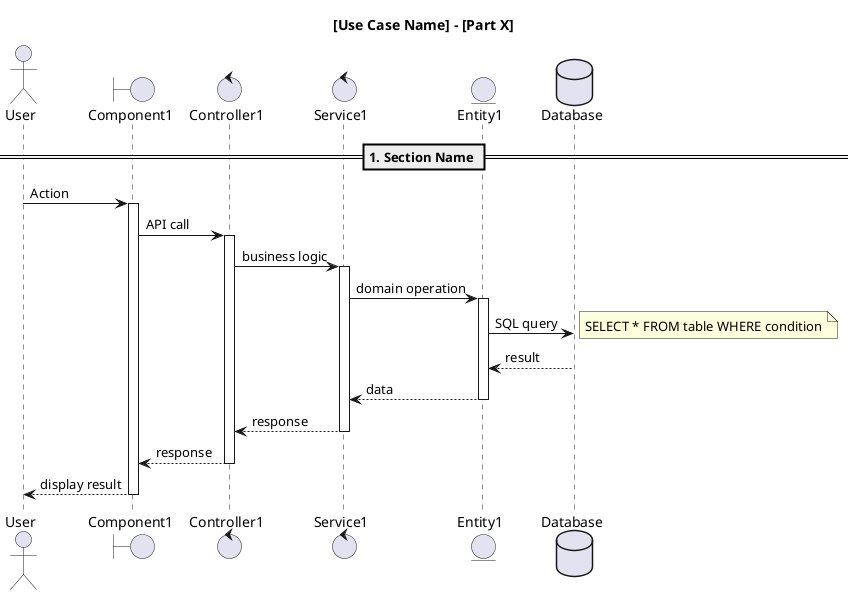

# Back-end

- cài đặt cli: npm i -g @nestjs/cli

### generate resource

- nest g resource users ( sau đó chọn restapi + crud)
  nó sẽ tạo ra full luôn 1 cái users trong src : sẽ bao gồm full dto entity các kiểu

# database

- tạo model trong folder schema
  => npm run prisma:generate

### Người tạo thêm db + thay đổi db

- b1: phải tạo model trong schema.prisma (làm theo form mẫu)
- b2: chạy lệnh:

## npx prisma migrate dev --name "ten-thay-doi"

=> nó sẽ tạo ra 1 folder migrations - bên trong đó sẽ có câu lệnh sql tạo bảng đó
-> vào pgadmin refresh sẽ thấy có bảng các kiểu

## development

## Người update db
npx prisma migrate dev --name "change_database_to_new"
npx prisma migrate deploy

## người lấy db về 
npx prisma migrate dev

============= Prompt để vẽ sequence diagram cho các UC bằng cursor và plantuml =============

* copy paste prompt + cho UC nào + folder frontend của UC đấy

Vẽ sequence diagram bằng PlantUML cho use case [TÊN_USE_CASE] với các yêu cầu sau:

## Cấu trúc participants:
- Sử dụng cú pháp: actor, boundary, control, entity, database
- Không dùng participant với stereotype
- Bao gồm: Actor (user), Boundary (UI components), Control (controllers/services), Entity (domain entities), Database

## Flow requirements:
- Bắt đầu từ user interaction, không cần phần load page
- Theo đúng flow thực tế của use case
- Có lifetime (activate/deactivate) cho mỗi component
- Có error handling
- Có notes cho SQL queries và business logic

## Chia phần:
- Nếu flow ngắn: 1 part duy nhất
- Nếu flow dài: chia thành 2-3 parts theo logic nhóm chức năng
- Mỗi part có title riêng và tập trung vào một nhóm chức năng

## Format:
- Title: "[Use Case Name] - [Part X if applicable]"
- Sử dụng == để chia sections
- Có alt/else cho validation và error cases
- Có loop cho repeated operations
- Notes cho SQL queries và business logic

## Example structure:

Hãy phân tích code trong thư mục [THƯ_MỤC] và tạo sequence diagram theo template này.

hoặc thay bằng tay

## Cách sử dụng:
1. Thay **[TÊN_USE_CASE]** bằng tên use case cụ thể
2. Thay **[THƯ_MỤC]** bằng đường dẫn thư mục chứa code
3. Copy paste prompt này và sử dụng cho mọi use case khác

Prompt vẽ class diagram:

Bạn là trợ lý tạo sơ đồ lớp bằng PlantUML cho hệ thống NestJS + Prisma. Hãy tạo 1 file PlantUML duy nhất mô tả lớp domain, DTO, Controller, Service theo format sau và không thêm mô tả ngoài code.

Yêu cầu đầu ra:
- Đầu ra là PlantUML hoàn chỉnh, có @startuml/@enduml.
- Phần style giống mẫu: skinparam classAttributeIconSize 0, nền trắng, classFontSize 12.
- Có 3 nhóm lớp:
  1) Domain entities (từ Prisma): với thuộc tính tên + kiểu cơ bản (UUID, String, Date, BigInt…).
  2) DTOs (từ src/modules/[module]/dto/...): chỉ các field chính và mối quan hệ lồng nhau (composition *--).
  3) Application layer: [Feature]Controller (các method public), [Feature]Service (các method public), [Feature]Transformer nếu có.
- Quan hệ:
  - Entities: dùng --> cho quan hệ FK (ví dụ Attendance --> Student : studentId).
  - Controller ..> Service : calls.
  - Service ..> Entity/Transformer : uses.
  - DTO composition: AttendanceDto *-- StudentDto : student.
- Không xuất thêm ghi chú, chỉ PlantUML.

Thông tin use case:
- Tên module: [điền tên module, ví dụ: teacher]
- Tên use case/feature: [ví dụ: Attendance]
- Entities chính và khóa/quan hệ: [liệt kê, ví dụ: StudentSessionAttendance(id,bigint); ClassSession(id,uuid); Student(id,uuid); User(id,uuid). Liên hệ: Attendance.sessionId -> ClassSession.id; Attendance.studentId -> Student.id; Attendance.recordedBy -> User.id]
- Controller file: [đường dẫn/summary method, ví dụ: attendance.controller.ts: getAttendanceBySessionId(sessionId), attendanceStudentBySessionId(req, sessionId, records)]
- Service file: [đường dẫn/summary method, ví dụ: attendance.service.ts: getAttendanceBySessionId(sessionId), attendanceStudentBySessionId(sessionId, records, teacherId)]
- Transformer (nếu có): [tên + method response(instance)]
- DTO chính: [liệt kê và field, ví dụ: AttendanceResponseDto(id, sessionId, studentId, status, note, recordedBy, recordedAt, student:StudentResponseDto, session:SessionResponseDto); StudentResponseDto(...); SessionResponseDto(...)]
- Kiểu dữ liệu chuẩn hóa: UUID, String, Number, BigInt, Boolean, Date.
- Đường dẫn lưu file (tôi sẽ tự tạo): server/src/modules/[module]/diagrams/[feature-kebab]-class-diagram.puml

Hãy xuất đúng định dạng PlantUML sau:

@startuml
skinparam classAttributeIconSize 0
skinparam backgroundColor #FFFFFF
skinparam classFontSize 12
skinparam class {
  BackgroundColor White
  BorderColor Black
}

' ========== Domain entities ==========
class "Entity1" as Entity1 {
  +field: Type
}

' (các entity khác…)

' ========== DTOs ==========
class "Dto1" as Dto1 {
  +field: Type
}
Dto1 *-- Dto2 : relationName

' ========== Application layer ==========
class "[Feature]Controller" as FeatureController {
  +method(params): ReturnType
}
class "[Feature]Service" as FeatureService {
  +method(params): ReturnType
}
class "[Feature]Transformer" as FeatureTransformer {
  +response(instance: Entity): Object
}

' ========== Relationships ==========
EntityA --> EntityB : foreignKeyName
FeatureService ..> EntityA : uses
FeatureController ..> FeatureService : calls
FeatureController ..> DtoMain : returns

@enduml

## Cách sử dụng:
Prompt + thư mục + vẽ cho t ...
